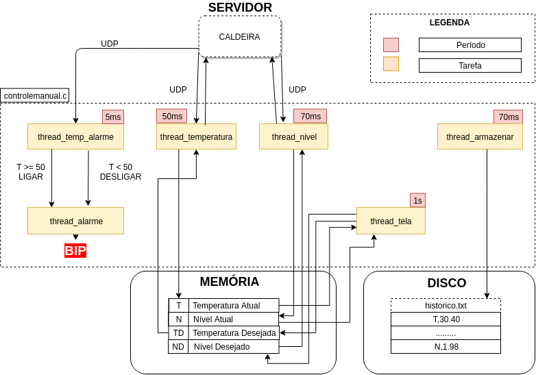

# str-controlador

Aquecedor e Controlador de Software em Tempo Real usando TCP/IP Socket
UDP. Um diagrama a seguir pode ser visto de como funciona a aplicação.


O uso de threads é gerenciado pela biblioteca `pthread` de C, onde
cada uma dessas threads são funções que executam tarefas periódicas:
uma thread para ler os sensores e salvar num vetor; outra thread
apenas responsabilizada para imprimir o que foi lido.

## v1.0.0



## v0.1.0 (old)


# Autores

+ Pedro Renoir Silveira Sampaio - 389113
+ Samuel Hericles Souza Silveira - 389118
+ Geronimo Pereira Aguiar - 385145
+ Manoel Vilela Machado Neto - 394192
+ Rayon Lindraz Nunes - XXXXXX

# Como executar

Rode o servidor com este comando:

``` shell
make server
```

Clique em simular.

Rode então o cliente com este comando:

``` shell
make run
```


Tente atualizar os sensores pela interface do servidor e verifique a
saída do cliente.


# Dependências:

+ make
+ gcc
+ java

Em um sistema baseado no Debian, você poderá instalar os pacotes da
seguinte maneira:

``` shell
sudo apt update;
sudo apt install build-essentials default-jre libncurses5-dev libncursesw5-dev -y
```
