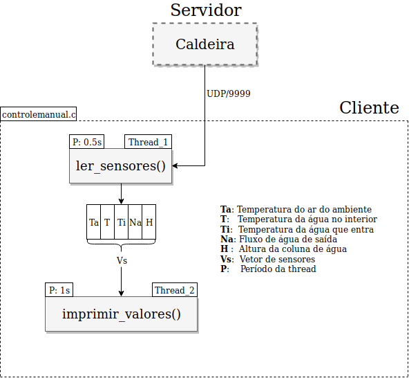

# str-controlador
Aquecedor/Controlador Software em Tempo Real usando TCP/IP Socket UDP.




# Dependências:

+ make
+ gcc
+ java

# Como executar

Rode o servidor com este comando:

``` shell
make server
```

Clique em simular.

Rode então o cliente com este comando:

``` shell
make run
```


Tente atualizar os sensores pela interface do servidor e verifique a
saída do cliente.
